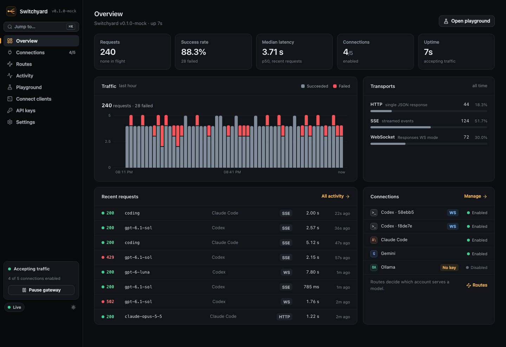

# Switchyard

**One local gateway. Your models. A control room you actually want to use.**

Switchyard is an open-source Rust gateway for coding agents and AI clients. Connect Codex and Claude subscription accounts or API providers, give every client one endpoint, and see what happens without recording prompts.

Inspired by [Maria's request](https://x.com/maria_rcks/status/2105868321853984972) for CLIProxyAPI in Rust, with a nice UI and WebSockets. Maria works on T3 Code; the design targets developers who move between coding agents and want their provider connections to keep up.



*Control room shown with the development-only demo fixture. The shipped app starts with your actual connections and traffic.*

## What it does

- **Embedded control room.** Overview, connections, model routes, request activity, playground, client keys, client setup snippets and settings, served from the same binary.
- **Native endpoints.** OpenAI Responses and Chat Completions, Anthropic Messages and token counting, and Gemini `generateContent`/`streamGenerateContent`. Provider fields and errors pass through instead of being guessed.
- **Codex and Claude accounts.** Sign in with your browser (PKCE) to get an account Switchyard refreshes itself, or import an existing Codex CLI, Claude Code or CLIProxyAPI login read-only. Codex also gets a Chat Completions adapter.
- **Persistent Responses WebSockets.** One upstream socket per client socket, bidirectional, for many `response.create` turns, tool results and `previous_response_id`.
- **Streaming that tells the truth.** SSE is forwarded incrementally with backpressure and cancellation. A stream that ends without its protocol's completion marker gets a structured `upstream_interrupted` error event and is logged as a failure, not a success.
- **Multi-account reliability.** Round-robin and failover routes, account cooldowns that follow `Retry-After` and provider reset hints, and response affinity that keeps a conversation on the account that owns it, even across restarts.
- **Account visibility.** Each connection shows whether it is ready, rate limited per model, cooling down or disabled, with its last result and credential expiry. The provider's own model catalog can be listed to choose identifiers, and any request still in the history can be looked up by id.
- **Private by default.** Loopback bind, separate admin and client credentials, hashed client keys, per-browser admin sessions with logout, metadata-only request history.

Switchyard is an independent implementation, not a full port of every CLIProxyAPI provider. See the [compatibility guide](docs/compatibility.md) for exact protocol behavior and limits.

## Run from source

Requires the Rust toolchain pinned in `rust-toolchain.toml` (1.98.1), Node 24 and pnpm 12.

```sh
git clone https://github.com/RealSid08/switchyard.git
cd switchyard
pnpm --dir ui install --frozen-lockfile
pnpm --dir ui build
cargo build --release --locked
./target/release/switchyard
```

Open **http://127.0.0.1:7410**. The UI is compiled into the binary; Node is only needed to build it. Build the UI first: the Rust build embeds `ui/dist`.

1. Add a connection under Connections: an API key, a browser sign-in, or an import of a local CLI login.
2. Test the connection and adjust its model identifiers to the ones your account can use.
3. Create a client key under Keys. It is shown once.
4. Point your client at `http://127.0.0.1:7410/v1` with that key. See [client setup](docs/clients.md).

```sh
curl http://127.0.0.1:7410/v1/responses \
  -H "Authorization: Bearer $SWITCHYARD_API_KEY" \
  -H 'Content-Type: application/json' \
  -d '{"model":"gpt-6.1-sol","input":"Explain this repository","stream":true}'
```

Imports are also available from the command line. They read files on the **machine running Switchyard** and never modify them. If the server is running, the CLI hands the import to it through the admin API (pass the same `--port` the server uses); otherwise it writes to the data directory directly. Relative `--path` values are resolved from your current directory.

```sh
switchyard import codex                 # $CODEX_HOME/auth.json or ~/.codex/auth.json
switchyard import claude                # $CLAUDE_CONFIG_DIR or ~/.claude, then the macOS Keychain
switchyard import cliproxy --path /path/to/cliproxy/auths
switchyard token-path                   # where the admin token lives
switchyard --help
```

Use only accounts you are authorized to use. Subscription endpoints are unofficial integrations and can change without notice; API-key providers use their documented APIs. [Account sign-in](docs/oauth.md) explains who refreshes which token.

### Docker

```sh
docker compose up --build
```

The image runs as an unprivileged user, listens on `0.0.0.0` inside the container, and Compose publishes it on `127.0.0.1:7410` only. Because the process is not bound to loopback, the dashboard cannot bootstrap a local session automatically; sign in with the admin token, read with `docker compose exec switchyard cat /home/switchyard/.local/share/switchyard/admin-token`. CLI imports inside the container cannot see logins on the host, so use API keys or browser sign-in. The sign-in callback listener is inside the container, so after approving, paste the callback URL from the browser's address bar (see [account sign-in](docs/oauth.md#switchyard-on-another-machine)).

## Configuration

| Option | Default |
| --- | --- |
| `--host` / `SWITCHYARD_HOST` | `127.0.0.1` |
| `--port` / `SWITCHYARD_PORT` | `7410` |
| `--data-dir` / `SWITCHYARD_DATA_DIR` | `$XDG_DATA_HOME/switchyard`, else `~/.local/share/switchyard` |
| `--max-in-flight` | `64` concurrent requests and WebSocket sessions (1 to 4096) |
| `--timeout` | `300` seconds (1 to 86400) |
| `SWITCHYARD_PUBLIC_ORIGIN` | unset; set to `https://your-host.example` behind a TLS proxy |

`--timeout` is the total limit for non-streaming requests, the inactivity limit for streams (and for Codex, which always streams upstream), and the idle limit for WebSocket sessions. Long agent runs keep going as long as data keeps flowing.

## Security in one paragraph

The data directory is created with mode 0700 and the database and admin token with 0600; Switchyard refuses to start in an existing directory that other users can read, in `/` or in your home directory, or with an empty or malformed admin token file. The admin token lives in `admin-token` inside the data directory. Provider tokens are stored in SQLite **unencrypted**, because they must be sent upstream; use disk encryption and keep backups private. Client keys are stored as SHA-256 hashes. Management responses never include provider tokens. The local dashboard gets an HttpOnly, SameSite=Strict session; remote administration needs the admin token. There is no permissive CORS policy. Read [SECURITY.md](SECURITY.md) before exposing Switchyard beyond loopback.

## Develop and contribute

```sh
# Terminal 1: Rust server
cargo run -- --data-dir ./data

# Terminal 2: UI with a same-origin development proxy
SWITCHYARD_PORT=7410 pnpm --dir ui dev

# Required checks
pnpm --dir ui typecheck
pnpm --dir ui lint
pnpm --dir ui test
pnpm --dir ui build
cargo fmt --check
cargo clippy --locked --all-targets -- -D warnings
cargo test --locked
```

The Rust integration tests start real gateways against loopback mock providers in temporary directories. They need no network access and never touch your CLI logins.

See [CONTRIBUTING.md](CONTRIBUTING.md), [architecture](docs/architecture.md), [compatibility](docs/compatibility.md), [account sign-in](docs/oauth.md), [client setup](docs/clients.md), [security policy](SECURITY.md) and the [changelog](CHANGELOG.md). CI checks the UI, then runs Rust formatting, Clippy and tests on Linux, macOS and Windows and builds the release binary. Tagged releases publish platform archives with SHA-256 checksums. Dependabot proposes dependency and GitHub Actions updates.

## Credits and license

MIT. Built by Sidhaarth Krishnan with Codex and Claude; Claude Opus 5.5 owns the UI/UX direction. Thanks to [Maria](https://github.com/maria-rcks) for the prompt and to [CLIProxyAPI](https://github.com/router-for-me/CLIProxyAPI) for documenting the ecosystem and provider behavior. Switchyard is not affiliated with OpenAI, Anthropic, Google or T3 Code.
